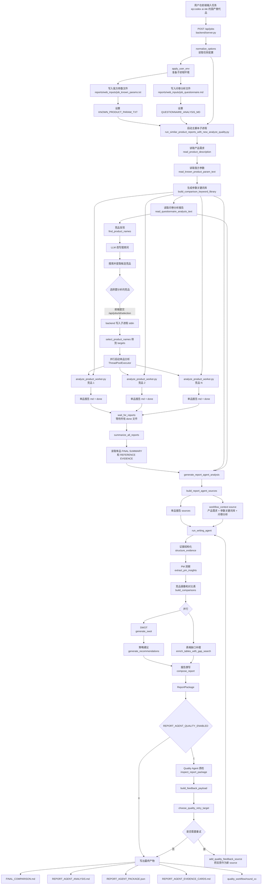
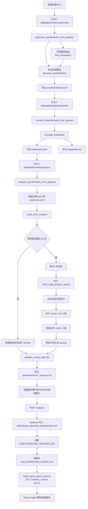
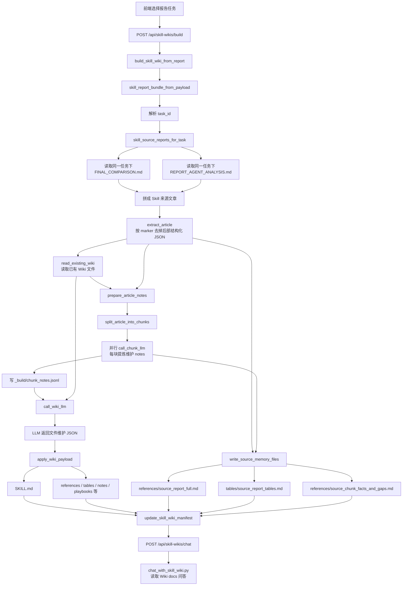

# 多 Agent 竞品分析系统核心流程图

以下流程图按当前源码调用链整理，而不是按概念架构重画。核心入口是 `backend/server.py` 启动 `run_similar_product_reports_with_new_analyze_quality.py` 子进程。

## 1. 主业务流程

## 2. 问卷作为侧端输入进入主流程

## 3. 报告数据集 Skill Wiki 化流程

