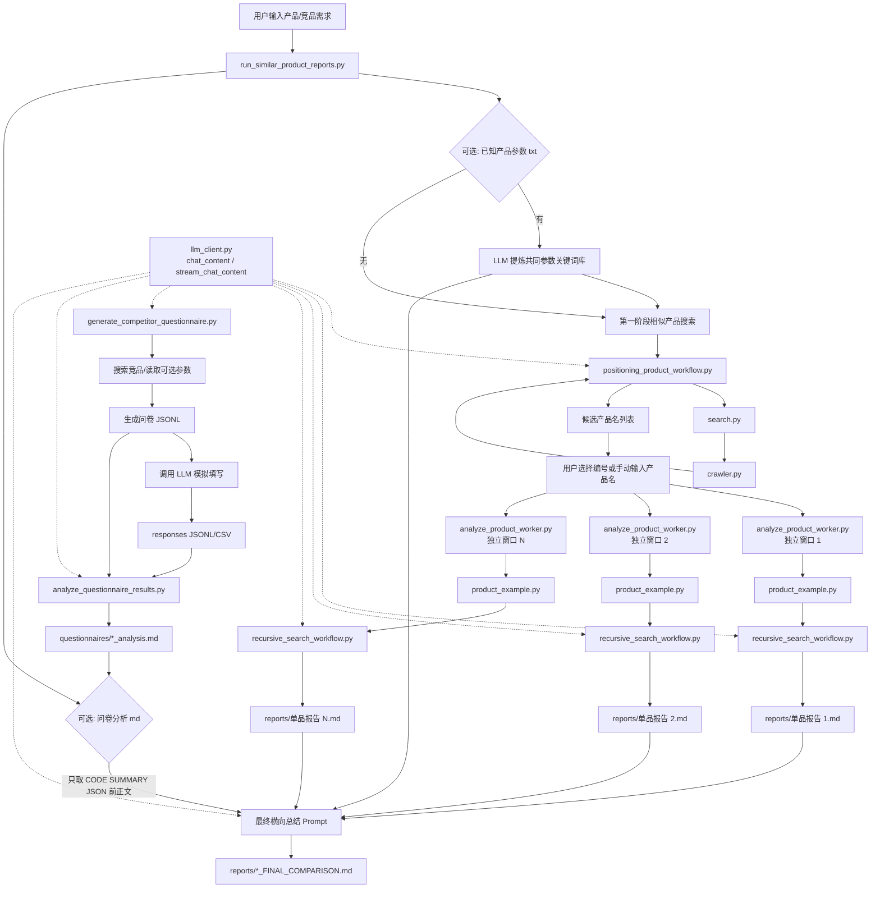

# 从底层到表层的代码架构解析

本文解析 `extracted_core/`、表层竞品报告脚本 `run_similar_product_reports.py`，以及问卷生成/分析脚本的分层关系、数据流和主要封装功能。整体目标是：输入一个产品需求，搜索相似产品，选择若干产品，并行做递归搜索分析，生成带参考点的横向总结；也可以额外生成问卷、模拟填写、独立分析问卷结果，并把问卷分析正文接入最终横向总结。

## 1. 总体分层

项目可以按六层理解：

1. 基础 HTTP/LLM 层：`llm_client.py`
2. 网页抓取与搜索层：`crawler.py`、`search.py`
3. LLM 搜索工作流层：`positioning_product_workflow.py`、`recursive_search_workflow.py`
4. 单产品分析 CLI 层：`product_example.py`、`analyze_product_worker.py`
5. 问卷调研侧路层：`generate_competitor_questionnaire.py`、`analyze_questionnaire_results.py`
6. 顶层编排层：`run_similar_product_reports.py`

总体架构图：



简单数据流：

```text
用户输入产品需求
  -> run_similar_product_reports.py
  -> positioning_product_workflow.py 找相似产品名
  -> 用户选择产品
  -> analyze_product_worker.py 开多个独立窗口
  -> product_example.py
  -> recursive_search_workflow.py 递归搜索与单品总结
  -> reports/*.md
  -> run_similar_product_reports.py 等待报告完成
  -> 可选读取 questionnaires/*_analysis.md 的问卷分析正文
  -> 做融合了单品证据、参数关键词库、问卷分析的总总结
  -> reports/*_FINAL_COMPARISON.md
```

问卷侧路数据流：

```text
用户输入产品/竞品方向
  -> generate_competitor_questionnaire.py
  -> 搜索相关竞品，可选读取自己产品参数 txt
  -> 生成 questionnaires/*.jsonl 问卷
  -> 调用 LLM 模拟填写
  -> 生成 responses.jsonl / responses.csv
  -> analyze_questionnaire_results.py 独立读取问卷和回答
  -> 生成 questionnaires/*_analysis.md
  -> 可选提供给 run_similar_product_reports.py 的最终横向总结
```

## 2. 基础 LLM 层：llm_client.py

`llm_client.py` 是所有模型调用的底层封装，使用 OpenAI-compatible `/chat/completions` 接口。

核心函数：

- `_chat_completions_url(base_url)`：把不同形式的 base URL 规范化为 chat completions endpoint。
- `create_chat_completion(...)`：发送普通非流式请求，带简单重试。
- `chat_content(...)`：取出第一条 choice 的 message content，供上层直接拿文本。
- `stream_chat_content(...)`：处理 SSE 流式返回，逐块 yield content。

上层多数 LLM 调用都走 `chat_content`；最终单品总结和总总结可以走 `stream_chat_content` 以便在命令行实时输出。

## 3. 网页抓取层：crawler.py

`crawler.py` 负责把 URL 抓下来并抽取正文。

主要流程：

1. 优先用 `trafilatura.fetch_url(url)` 下载页面。
2. 如果失败或需要代理，则用 `requests.get(...)` 下载 HTML。
3. 用 `trafilatura.extract(...)` 抽正文。
4. 如果正文抽取失败，走 fallback：
   - `meta description`
   - `og:description`
   - JSON-LD 里的 `articleBody/content/description`
   - 页面脚本中的 `articleContent/content/abstract/description`
5. `_normalize_text` 清理空白并按 `max_chars` 截断。

注意：这里抓到的是“抽取后的正文”，不是浏览器渲染后的完整页面。动态渲染或反爬页面可能只能拿到搜索摘要。

## 4. 搜索层：search.py

`search.py` 统一封装三种搜索来源：

- `bocha`
- `google`
- `duckduckgo`

核心数据结构：

- `SearchConfig`：搜索配置，包括 API key、返回数量、代理、爬取长度、语言等。
- `SearchResult`：单条搜索结果，包含 `title/url/snippet/content/source/content_source`。

核心函数：

- `search_bocha(query, config)`
- `search_google(query, config)`
- `search_duckduckgo(query, config)`
- `search(query, config)`：按 `SearchSource` 分发。
- `_crawl_or_snippet(result, config)`：搜索结果拿到 URL 后尝试爬正文。

`content_source` 用来标记正文来源：

```text
网页正文
搜索摘要
```

如果爬取正文太短，会回退到搜索 API 返回的 snippet/summary。

## 5. 相似产品发现层：positioning_product_workflow.py

这个模块负责第一阶段：把用户描述转换成搜索词，搜索网页，再从搜索结果里抽取产品名。

核心数据结构：

- `PositioningProductConfig`
- `PositioningProductResult`

核心流程：

```text
run_positioning_product_search(product_description, config)
  -> rewrite_search_queries
  -> collect_search_results
  -> extract_product_names
```

具体职责：

- `rewrite_search_queries`：LLM 把用户输入改写成适合搜索“类似产品/同类产品/竞品/替代品”的关键词。
- `collect_search_results`：逐个关键词调用 `search(...)`，按 URL 去重。
- `extract_product_names`：LLM 从搜索结果里抽取产品名，只返回 JSON 数组。

这一步只用于找候选产品，不参与后续已知产品参数关键词库。

## 6. 递归搜索核心：recursive_search_workflow.py

这是单产品深度分析的核心。它把产品名作为根节点，用搜索树不断扩展搜索词，收集参考点，最后生成单品调研总结。

核心数据结构：

- `RecursiveSearchConfig`：递归搜索配置。
- `EvidenceItem`：参考点。
- `SearchNode`：搜索树节点。
- `TreeSearchResult`：树搜索结果。

### 6.1 搜索树逻辑

入口是：

```python
run_tree_search(question, config)
```

每个节点流程：

```text
搜索当前节点 query
  -> 过滤不相关搜索结果
  -> 转成 EvidenceItem
  -> LLM 总结当前节点证据
  -> 如果未到最大深度，LLM 规划子搜索词
  -> 生成子节点
```

相关参数：

- `max_rounds`：树深度。
- `next_query_count`：每个节点最多生成多少个子节点。
- `results_per_query`：每个搜索词返回多少条搜索结果。
- `max_evidence_items`：最多保留多少个参考点。
- `max_parallel_nodes`：同一层最多并发处理多少个节点。

理论最大节点数：

```text
sum(next_query_count ** depth for depth in range(max_rounds))
```

例如 `max_rounds=2`、`next_query_count=3`，理论最大节点数是 `1 + 3 = 4`。

### 6.2 参考点过滤

`filter_relevant_search_results(...)` 会让 LLM 判断搜索结果是否和当前调研主题相关。

被过滤掉的结果不会：

- 进入 `[参考点N]`
- 占用 `max_evidence_items`
- 进入最终总结

### 6.3 动态关键词库注入

如果表层传入了 `comparison_keyword_library`，底层会用 `_comparison_keyword_queue` 拆成关键词队列。

每个节点规划子搜索词时，会按 `next_query_count` 动态领取关键词：

```text
node=n1 使用关键词 1-3/7: 定价、价格、套餐
node=n2 使用关键词 4-6/7: 免费额度、部署、私有化
node=n3 使用关键词 7-7/7: SaaS
node=n4 关键词库已用完，自由搜索
```

领取过的关键词不会再用。关键词库耗尽后，模型按当前证据自由扩展搜索。

### 6.4 进度条

树搜索内部有文本进度条：

```text
[tree-progress] [##########--------------] 42.9% 已完成 3/7 节点；理论上限 7
```

它显示的是：

```text
已完成节点数 / 当前已发现节点数
```

因为树会动态增长，所以总量会随着子节点挂载而变化。

### 6.5 单品最终总结

`tree_final_summarize(...)` 用完整参考点和搜索树摘要生成单品总结。

它要求模型：

- 只基于参考点正文总结。
- 保留 `[参考点N]`。
- 如果关键词库存在，优先按共同参数点组织总结。
- 缺失证据要说明“未找到明确证据”。

## 7. 单产品 CLI：product_example.py

`product_example.py` 是单产品分析入口。它读取环境变量和命令行产品名，构造 `SearchConfig` 和 `RecursiveSearchConfig`，然后调用 `run_tree_search`。

它负责输出：

- 已知产品参数关键词库
- 搜索树进度
- 参考点统计
- `===== REFERENCE EVIDENCE =====`
- `===== FINAL SUMMARY =====`

关键默认参数：

```python
MAX_ROUNDS = 2
NEXT_QUERY_COUNT = 3
RESULTS_PER_QUERY = 5
MAX_EVIDENCE_ITEMS = 30
MAX_PARALLEL_NODES = 4
FILTER_IRRELEVANT_EVIDENCE = True
```

这些参数都可以用环境变量覆盖，例如：

```powershell
$env:MAX_ROUNDS="3"
$env:NEXT_QUERY_COUNT="4"
$env:RESULTS_PER_QUERY="5"
```

## 8. Worker 封装：analyze_product_worker.py

顶层脚本不会直接在当前窗口跑单品分析，而是为每个产品开独立命令行窗口。

`analyze_product_worker.py` 的职责：

1. 接收 `--product`、`--report`、`--done` 参数。
2. 把 stdout/stderr 同时写到控制台和报告文件。
3. 调用 `product_example.main()`。
4. 生成报告后写 `.done` 文件。
5. 保持窗口等待回车，方便用户查看日志。

它的 Tee 机制让日志同时显示和落盘。

## 9. 问卷调研侧路

问卷功能是独立脚本，不并入 `run_similar_product_reports.py` 的主流程。它用于把“竞品搜索结果 + 可选自己产品参数”转成调查问卷，再模拟填写，并支持后续独立分析。

### 9.1 问卷生成与模拟填写：generate_competitor_questionnaire.py

`generate_competitor_questionnaire.py` 的职责：

1. 输入产品/竞品方向。
2. 可选读取自己产品参数 txt。
3. 调用 `positioning_product_workflow.py` 搜索相关产品/竞品。
4. 把竞品搜索结果和自己产品参数交给 LLM，生成问卷 JSONL。
5. 调用豆包兼容 LLM 分批模拟填写问卷。
6. 保存回答为 JSONL 和 CSV。
7. 可直接调用内置分析函数生成分析报告。

主要输出：

```text
questionnaires/{timestamp}_{topic}.jsonl
questionnaires/{timestamp}_{topic}_responses.jsonl
questionnaires/{timestamp}_{topic}_responses.csv
questionnaires/{timestamp}_{topic}_analysis.md
```

其中问卷 JSONL 每行是一个题目对象：

```json
{"id":"Q001","dimension":"当前工具使用","question_type":"multiple_choice","question":"你目前主要使用哪些同类产品或工具？","options":["产品A","产品B"],"target_insight":"了解竞品使用情况","related_competitor_points":["竞品列表"],"source_basis":"来自搜索结果"}
```

回答 JSONL 每行是一个受访者对象：

```json
{"respondent_id":"R001","profile":{"role":"开发者","industry":"AI","current_tools":["产品A"]},"answers":[{"question_id":"Q001","answer":["产品A"],"reason":"日常使用"}]}
```

### 9.2 独立问卷分析：analyze_questionnaire_results.py

`analyze_questionnaire_results.py` 是后来拆出来的独立分析脚本。它不搜索、不生成问卷、不模拟填写，只读取已有文件：

```text
问卷 JSONL + 回答 JSONL/CSV -> 代码统计 -> LLM 中文分析报告
```

运行示例：

```powershell
E:\anaconda\python.exe E:\deep-learning\zhengce\analyze_questionnaire_results.py questionnaires\xxx.jsonl questionnaires\xxx_responses.jsonl "AI IDE 国产替代品"
```

它会输出：

```text
questionnaires/{timestamp}_{topic}_analysis.md
```

报告结构：

```text
# 问卷数据分析报告

LLM 生成的中文分析正文

===== CODE SUMMARY JSON =====
代码统计 JSON
```

`run_similar_product_reports.py` 接入问卷分析时，只读取 `===== CODE SUMMARY JSON =====` 前面的正文，避免把大段统计 JSON 塞给最终总结模型。

## 10. 顶层编排：run_similar_product_reports.py

这是当前主要入口。

完整流程：

```text
读取产品需求
  -> 可选读取已知产品参数 txt
  -> LLM 生成参数关键词库
  -> 可选读取问卷分析 md
  -> 第一阶段搜索相似产品
  -> 输出候选产品列表
  -> 用户选择产品或手动输入新产品
  -> 为每个产品启动独立 worker 窗口
  -> tqdm 等待每个报告完成
  -> 读取每个报告 FINAL SUMMARY
  -> 给引用加产品名前缀
  -> LLM 结合单品总结、参数关键词库、问卷分析正文生成横向总总结
  -> 写 FINAL_COMPARISON.md
```

### 10.1 Provider 选择

`active_provider()` 控制 LLM provider：

```python
LLM_PROVIDER=0
```

默认走 0 号配置。

```python
LLM_PROVIDER=1
```

走 1 号配置，可使用 `LLM_API_KEY` 或 `LLM_API_KEYS` 池。

```python
LLM_PROVIDER=2
```

走小米 MiMo 配置，默认：

```text
LLM2_BASE_URL=https://token-plan-cn.xiaomimimo.com/v1
LLM2_MODEL=Xiaomi MiMo-V2.5-Pro
```

需要通过环境变量设置 `LLM2_API_KEY`，代码里不写入 key。也可以直接在 `run_similar_product_reports.py` 顶部修改：

```python
LLM_PROVIDER = 0  # 0=豆包, 1=SiliconFlow, 2=小米 MiMo
```

### 10.2 已知产品参数 txt

运行时会询问：

```text
请输入已知产品参数 txt 路径（可直接回车跳过）:
```

如果提供 txt：

1. 读取 txt。
2. `build_comparison_keyword_library` 让 LLM 提取共同参数点和搜索关键词。
3. 关键词库通过环境变量 `COMPARISON_KEYWORD_LIBRARY` 传给每个 worker。
4. 单品递归搜索按 `NEXT_QUERY_COUNT` 动态消耗关键词。
5. 最终总总结按关键词库做横向对齐。

注意：该关键词库不参与第一阶段找相似产品。

### 10.3 问卷分析报告 md

运行时会询问：

```text
请输入问卷分析报告 md 路径（可直接回车跳过）:
```

也可以用环境变量跳过交互：

```powershell
$env:QUESTIONNAIRE_ANALYSIS_MD="E:\deep-learning\zhengce\questionnaires\xxx_analysis.md"
```

如果提供问卷分析报告：

1. 读取 Markdown。
2. 只保留 `===== CODE SUMMARY JSON =====` 前面的正文。
3. 如果正文太长，按 `QUESTIONNAIRE_ANALYSIS_MAX_CHARS` 截断。
4. 最终横向总结时，把它作为“用户侧/需求侧/决策侧补充背景”发给模型。

注意：

- 问卷分析不会参与第一阶段相似产品搜索。
- 问卷分析不会参与单品递归搜索。
- 最终 prompt 明确要求：单品事实和引用来自单品 `FINAL SUMMARY`，问卷分析只作为用户画像、场景、价格敏感度、替换意愿、采购决策和风险顾虑的补充。

### 10.4 产品选择

第一阶段抽取产品名后，会输出编号列表。

支持：

```text
1 3
```

选择第 1、第 3 个候选产品。

也支持手动输入产品名：

```text
豆包 MarsCode
```

混合输入建议用逗号：

```text
1, 3, 豆包 MarsCode, Cursor
```

直接回车默认选择前 `TOP_N` 个。

### 10.5 并行窗口

`analyze_product(...)` 使用：

```python
subprocess.CREATE_NEW_CONSOLE
```

在 Windows 上给每个产品开独立窗口。

每个窗口都会：

- 显示自己的搜索树日志
- 流式输出最终单品总结
- 写入独立 Markdown 报告
- 完成后写 `.done`

### 10.6 主窗口进度条

主窗口等待报告完成时使用 `tqdm`：

```text
等待产品报告: 67%|██████▋| 2/3
```

每个报告完成后推进一格。

### 10.7 报告读取和引用前缀

单品报告里有两个关键段：

```text
===== REFERENCE EVIDENCE =====
...
===== FINAL SUMMARY =====
...
```

总总结前，主脚本会：

1. 读取每个报告。
2. 取 `FINAL SUMMARY` 后面的正文发给模型。
3. 把 `[参考点15]` 改成 `[产品名][参考点15]`。
4. 把 `REFERENCE EVIDENCE` 部分也加产品名前缀。

这样最后总报告里的引用不会混淆来源。

## 11. 最终输出文件

单品报告：

```text
reports/{timestamp}_{index}_{product_name}.md
```

完成标记：

```text
reports/{timestamp}_{index}_{product_name}.done
```

总总结报告：

```text
reports/{timestamp}_FINAL_COMPARISON.md
```

总报告结构：

```text
# 所选产品横向对比报告

原始需求

===== 已知产品参数关键词库 =====

===== 问卷分析补充背景 =====

===== FINAL COMPARISON SUMMARY =====

===== 带产品名前缀的参考点 =====

===== SOURCE FINAL SUMMARIES =====
```

问卷侧路输出：

```text
questionnaires/{timestamp}_{topic}.jsonl
questionnaires/{timestamp}_{topic}_responses.jsonl
questionnaires/{timestamp}_{topic}_responses.csv
questionnaires/{timestamp}_{topic}_analysis.md
```

## 12. 常用配置速查

顶层相似产品搜索：

```python
QUERY_COUNT      # LLM 改写几个搜索词
SEARCH_COUNT     # 每个搜索词取几条搜索结果
TOP_N            # 回车默认选择前几个产品
ANALYZE_TIMEOUT  # 等待单品报告超时秒数
```

搜索后端：

```python
SEARCH_BACKEND = 0  # 博查搜索 URL + 传统爬虫抓正文
SEARCH_BACKEND = 1  # 博查搜索 URL + Playwright 动态渲染抓正文
SEARCH_BACKEND = 2  # 博查搜索 URL + Crawl4AI 抓正文
```

单品递归分析：

```python
MAX_ROUNDS          # 搜索树深度
NEXT_QUERY_COUNT    # 每个节点最多几个子节点
RESULTS_PER_QUERY   # 每个搜索词返回几条结果
MAX_EVIDENCE_ITEMS  # 最多保留多少参考点
MAX_PARALLEL_NODES  # 同层并行节点数
```

LLM provider：

```powershell
$env:LLM_PROVIDER="0"
$env:LLM0_API_KEY="..."
$env:BOCHA_API_KEY="..."
```

或：

```powershell
$env:LLM_PROVIDER="1"
$env:LLM_API_KEYS="key1,key2,key3"
$env:BOCHA_API_KEY="..."
```

或：

```powershell
$env:LLM_PROVIDER="2"
$env:LLM2_API_KEY="..."
$env:LLM2_BASE_URL="https://token-plan-cn.xiaomimimo.com/v1"
$env:LLM2_MODEL="Xiaomi MiMo-V2.5-Pro"
$env:BOCHA_API_KEY="..."
```

已知产品参数 txt：

```powershell
$env:KNOWN_PRODUCT_PARAM_TXT="E:\path\known_product.txt"
```

问卷生成/模拟填写：

```python
COMPETITOR_LIMIT          # 问卷生成时最多纳入多少个相关产品名
QUESTION_COUNT            # 生成多少个问卷题目
SIMULATED_RESPONSE_COUNT  # 模拟多少份填写结果
SIMULATION_BATCH_SIZE     # 每批让模型生成几份回答
```

问卷分析接入最终横向总结：

```powershell
$env:QUESTIONNAIRE_ANALYSIS_MD="E:\path\xxx_analysis.md"
$env:QUESTIONNAIRE_ANALYSIS_MAX_CHARS="16000"
```

## 13. 可维护性提示

- 想改“第一阶段怎么找相似产品”：看 `positioning_product_workflow.py`。
- 想改“递归搜索树怎么扩展”：看 `recursive_search_workflow.py` 的 `plan_child_queries` 和 `run_tree_search`。
- 想改“单品报告格式”：看 `product_example.py`。
- 想改“并行窗口、选择产品、最终总总结”：看 `run_similar_product_reports.py`。
- 想改“问卷怎么生成、怎么模拟填写”：看 `generate_competitor_questionnaire.py`。
- 想改“已有问卷和回答怎么分析”：看 `analyze_questionnaire_results.py`。
- 想改“网页正文抽取”：看 `crawler.py`。
- 想改“搜索 API 来源”：看 `search.py`。
