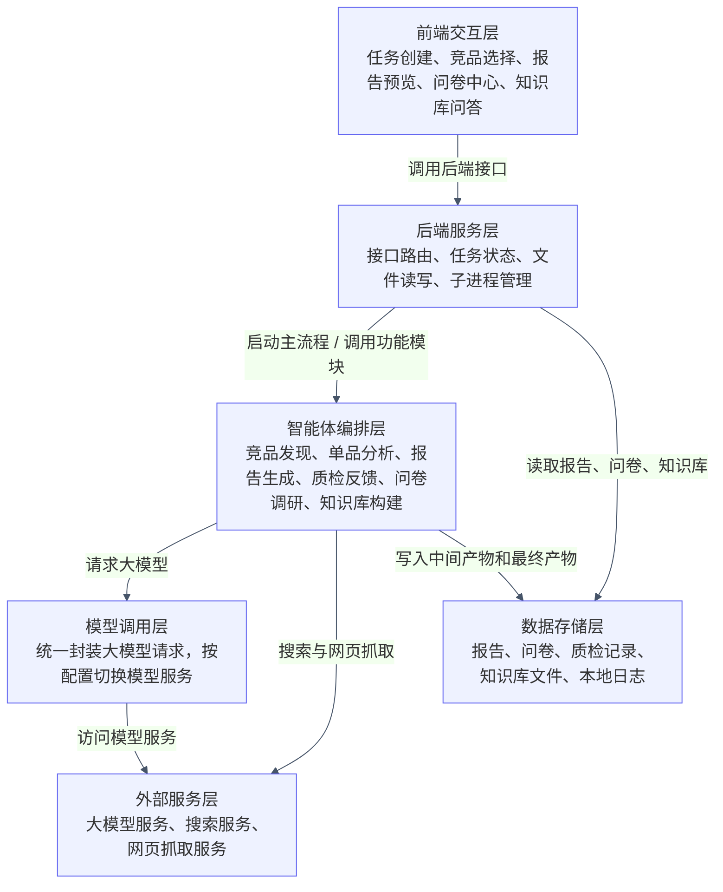
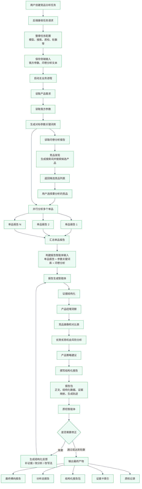
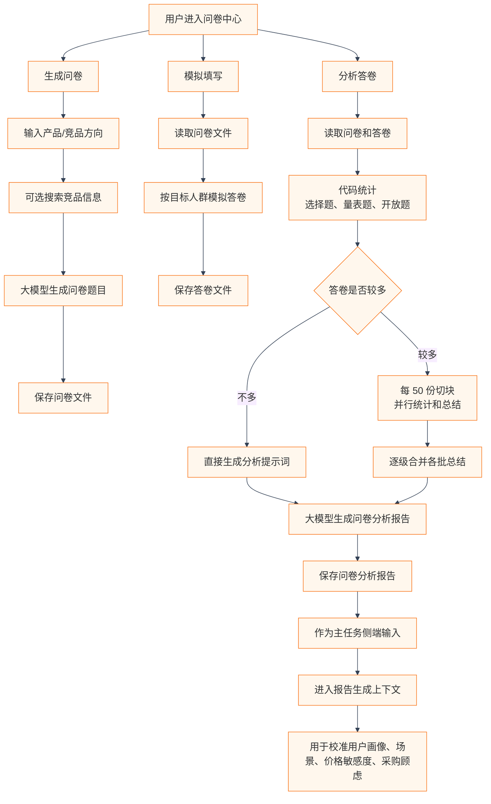
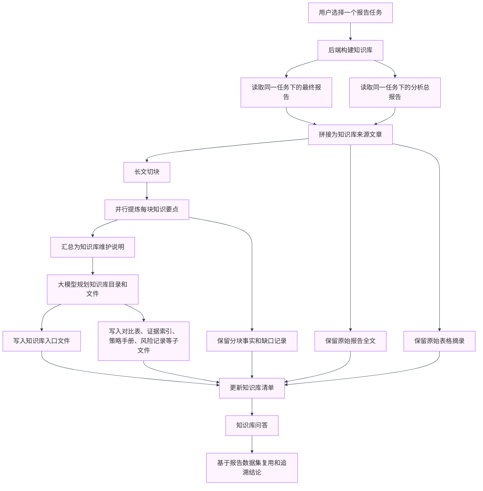

## 系统架构图

原来的单张大图会被 Markdown 预览器缩得很小，所以这里拆成 4 张图：一张总览图，三张局部调用图。
### 1. 系统分层总览

### 2. 主竞品分析任务调用关系

### 3. 问卷中心调用关系

### 4. 知识库skill化构建调用关系

### 调用关系摘要

- 前端负责交互展示，后端负责接口、任务状态和文件读写。
- 主业务由后端启动独立进程执行，避免长任务阻塞页面。
- 智能体编排层把竞品发现、单品分析、报告生成和质检反馈串起来。
- 问卷分析和我方参数不是独立报告结尾才接入，而是作为侧端输入进入主报告上下文。
- 知识库构建读取已有报告，把一次分析沉淀成可复用、可问答、可追溯的资料库。
