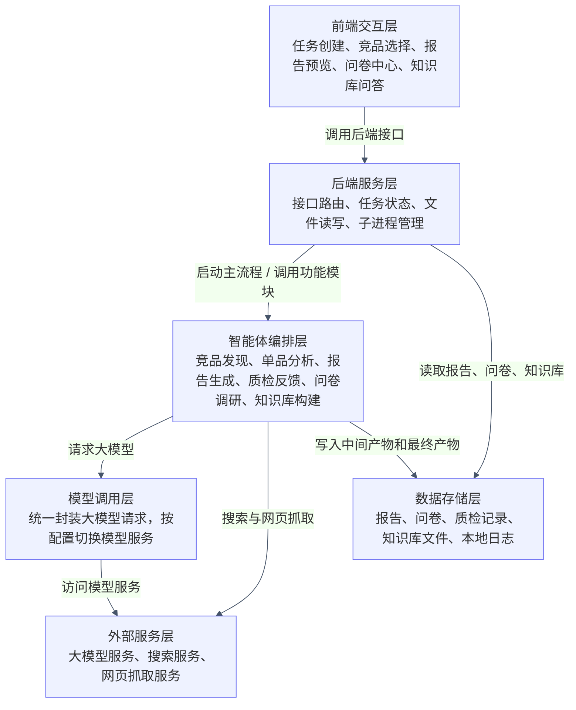
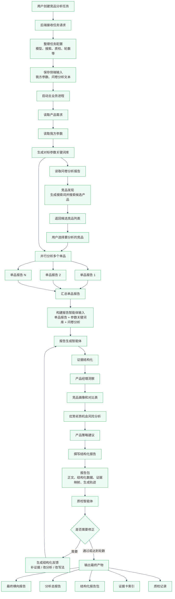
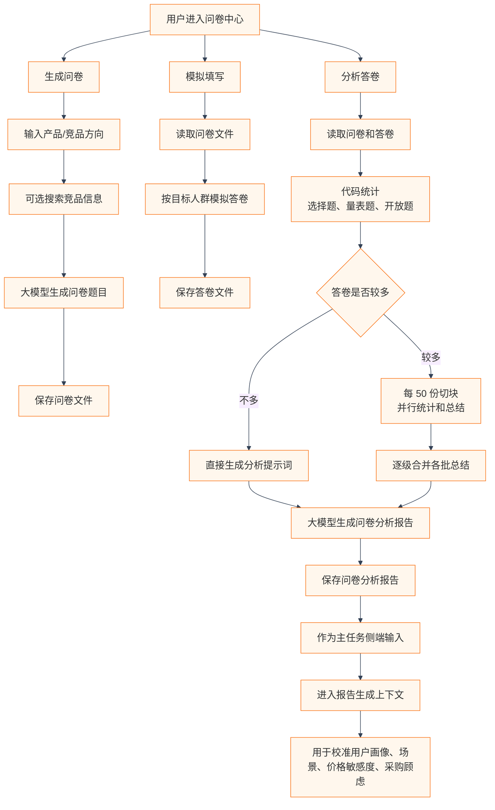
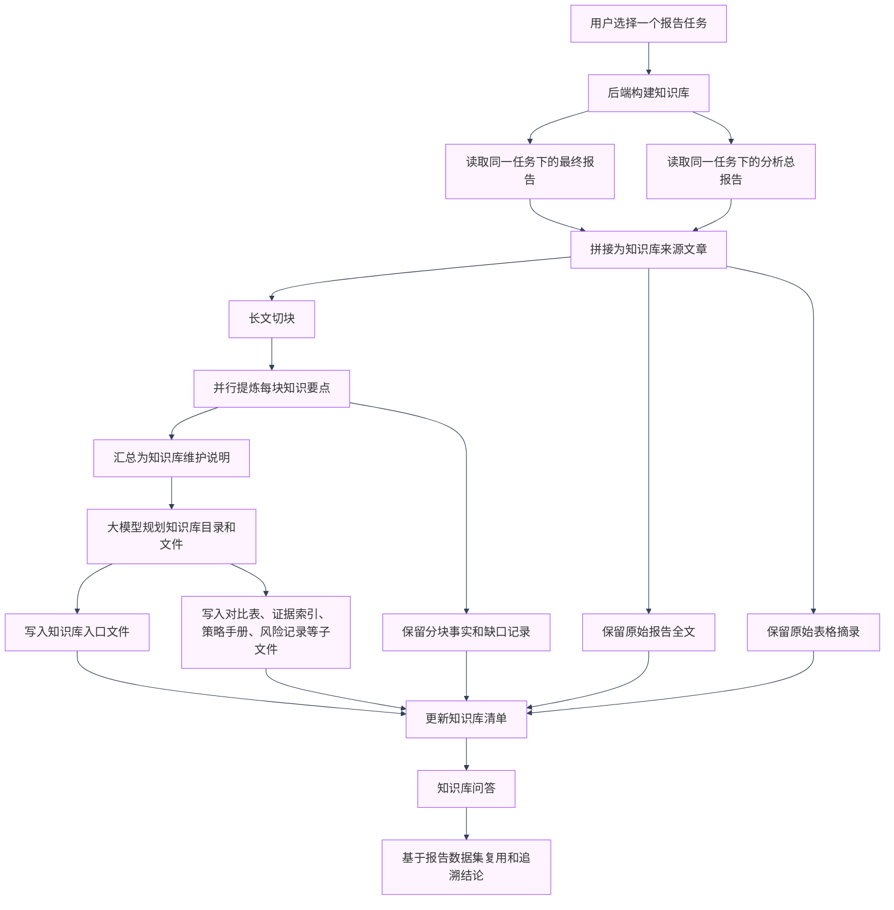

# 一、基础信息

## 项目名称
AI 驱动的竞品分析 Agent 协作系统

### 参赛课题
CIS - AI 驱动的竞品分析 Agent 协作系统

### 团队名称
赛博三人行

## 团队成员

| 成员 | 学校 | 专业 | 年级 |
|--------|--------|--------|--------|
| 赵健翔（队长） | 新南威尔士大学 | 计算机科学 | 2027届本科 |
| 师小淋 | 新南威尔士大学 | 信息技术 | 2027届研究生 |
| 南宫秀成 | 广州大学 | 人工智能 | 2027届本科生 |

### 分工说明

| 成员 | 角色 | 负责模块 |
|--------|--------|--------|
| 赵健翔 | Agent设计开发、全栈 | 质检Agent设计实现、前后端开发 |
| 师小淋 | Agent设计开发 | 报告Agent设计实现 |
| 南宫秀成 | 架构设计师、功能设计师、Agent开发、服务器运维、提交文档撰写 | 搜索Agent设计实现、整体Agent架构设计、个性化功能设计实现、Server版本改装和部署维护 多种爬虫模式的实现和维护 |

---

# 二、功能说明

### 系统核心能力一览

**1. 多角色 Agent 协作：** 信息采集 Agent、分析师 Agent、质检 Agent 三大核心角色独立运行、协同工作。

**2. 极致性能的信息联网检索设计：** 将搜索权交还模型，让 Agent 在互联网中自主规划搜索路径，通过独家设计的并行树与递归搜索结构实现信息搜索深度与广度兼备。

**3. 多种爬虫搜后端：** 提供三种爬虫模式。传统爬虫，Playwright，Crawl4AI。可以任意切换。

**4. 结构化知识抽取：**  **智能动态** 定义竞品知识 Schema，对不同产品类型具备极强泛化能力。

**5. DAG 任务流转：** Agent 间通过 Function Calling 进行结构化消息传递，支持质检打回与自动迭代闭环。

**6. 多层信息溯源：** 每条分析结论均标注数据来源，支持一键跳转至报告证据卡以及证据卡对应证据的来源。

**7. 可观测性：** 完整日志系统记录 Agent 决策过程，实现全流程可追溯。

**8. 报告自动生成：** 自动输出标准化 SWOT 分析报告、竞品对比矩阵及超详细功能对比表。

**9. 全自动问卷生成：** 上传我方产品参数后，系统自动联网搜索竞品并根据产品定位生成对应调研问卷。

**10. 智能问卷分析：** 上传问卷与答卷后自动完成统计分析，提取用户需求与痛点，并为后续竞品分析生成搜索关键词和调研方向。

**11. Wiki 化 Skill 助手：** 将已生成报告封装为 Skill，实现智能问答；同时支持问卷与报告 Wiki 化，方便知识沉淀与复用。

### 系统端到端使用流程

1. 用户在前端输入竞品分析需求（目标产品、竞品列表、分析维度等）。

2. 系统自动创建分析任务，并由搜索 Agent 联网搜索候选竞品及相关资料。

3. 搜索 Agent 采用并行树与递归搜索机制，对竞品信息进行深度采集与结构化整理。

4. 采集结果按照动态竞品知识 Schema 进行抽取与标准化处理，并传递至分析 Agent。

5. 分析 Agent 对竞品进行多维度对比分析，生成竞品对比矩阵、功能分析表及 SWOT 分析结果。

6. 质检 Agent 对分析结果进行事实校验、证据检查和完整性审核，不符合要求时自动打回重做。

7. 报告 Agent 汇总通过质检的分析结果，自动生成标准化竞品分析报告。

8. 用户可在前端查看完整报告，支持信息溯源、Issue 查看、报告下载及历史任务管理。

9. 用户可进一步生成调研问卷、分析问卷结果，并将报告沉淀为 Skill Wiki 知识库，实现知识复用与持续迭代。

### 推荐使用流程

1. 输入竞品分析需求并创建任务。
2. 确认候选竞品（如有需要）。
3. 等待系统完成搜索、分析、报告生成与质检。
4. 查看最终竞品分析报告与 Issue 结果。
5. 使用问卷模块补充用户调研分析。
6. 构建 Skill Wiki 知识库沉淀分析成果。
7. 在报告库中管理、下载和复用历史任务。

# 三、项目附件

| 序号 | 材料名称 | 说明 |
|------|----------|------|
| 1 | 在线 Demo | http://8.148.176.220:8008/  （登录密码：ngxc/ 博查api密钥：SK_API_KEY_REDACTED{请在设置中填写，该密钥有1000次搜索额度}） |
| 2 | 演示视频 | https://your-video-link.example.com（时长约 5 分钟） |
| 3 | 源代码仓库 | https://github.com/your-team/competitive-analysis-agent |
| 4 | README 文档 | 仓库根目录 README.md，包含项目简介、环境配置、部署方式、启动步骤及目录

## 系统架构图

原来的单张大图会被 Markdown 预览器缩得很小，所以这里拆成 4 张图：一张总览图，三张局部调用图。
### 1. 系统分层总览

### 2. 主竞品分析任务调用关系

### 3. 问卷中心调用关系

### 4. 知识库skill化构建调用关系

### 调用关系摘要

- 前端负责交互展示，后端负责接口、任务状态和文件读写。
- 主业务由后端启动独立进程执行，避免长任务阻塞页面。
- 智能体编排层把竞品发现、单品分析、报告生成和质检反馈串起来。
- 问卷分析和我方参数不是独立报告结尾才接入，而是作为侧端输入进入主报告上下文。
- 知识库构建读取已有报告，把一次分析沉淀成可复用、可问答、可追溯的资料库。
## 核心技术栈

| 层级 | 技术选型 |
| --- | --- |
| 前端 | 原生 HTML + CSS + JavaScript，基于浏览器 Fetch 调用后端接口，支持任务创建、竞品选择、报告预览、问卷中心和知识库问答 |
| 后端 | Python 标准库 HTTP 服务（ThreadingHTTPServer）+ 多线程任务管理 + 子进程启动主分析流程 |
| Agent 编排 | 自研 Python 编排流程，使用 subprocess、ThreadPoolExecutor、结构化反馈消息实现竞品发现、单品并行分析、报告生成、质检打回和循环修正 |
| 大模型 | 火山方舟 / 豆包兼容接口为主，兼容 SiliconFlow、小米 MiMo；统一通过自定义 LLM Client 调用，配合结构化 Prompt 模板 |
| 搜索与抓取 | 博查搜索、Google 自定义搜索、DuckDuckGo；网页抓取支持 requests、Playwright、trafilatura、Crawl4AI |
| 数据存储 | 本地文件系统存储，报告使用 Markdown / JSON，问卷使用 JSONL / CSV，质检和反馈记录使用 JSON / Markdown |
| 知识库 | 基于报告数据集自动生成 Skill Wiki，沉淀为 SKILL.md、references、tables、notes、playbooks 等可复用知识文件 |
| 部署（本地） | 本地 Python 环境运行，提供 PowerShell / BAT 启动脚本；通过本地 Web 服务访问前端页面 |
| 部署（云端） | 通过服务器版本部署在云服务器上，配置好Playwright和Chromium 依赖的图形组件通过python server.py运行 |
| 可观测 | 后端任务日志、运行阶段状态、单品分析产物、Report Agent 生成轨迹、Quality Agent 质检报告和反馈记录可追溯 |

## 大模型能力/agent架构/工具使用/依据来源说明

#### 🤖 模型调用

- **主模型**：火山方舟 / 豆包兼容模型，可通过环境变量切换。

- **兼容模型**：支持 SiliconFlow、小米 MiMo 等 OpenAI 兼容接口。

- **调用方式**：统一通过自定义 LLM Client 调用模型接口。

- **主要用途**：搜索词改写、竞品信息理解、问卷生成、问卷分析、证据结构化、竞品对比、SWOT 分析、策略建议、报告撰写。

- **长文本处理**：问卷答卷按 50 份切块，并行总结后逐级合并，降低上下文过长风险。

#### 🔧 Agent 设计

- **编排方式**：自研 Python 多 Agent 编排，不依赖 LangGraph / CrewAI 框架。

- **核心角色**：信息采集 Agent、问卷调研 Agent、分析师 Agent、报告撰写 Agent、质检 Agent、知识库构建 Agent。

- **通信协议**：通过结构化数据包传递，包括来源、证据卡、洞察、对比表、报告包、质检反馈。

- **溯源机制**：每条结论绑定 `source_id`、`evidence_id` 和 `claim_evidence_map`，支持追踪来源。

- **反馈机制**：质检 Agent 将问题打回到采集、分析或撰写环节，触发补证据、改结构或重写报告。

#### 🧰 工具调用

- **搜索工具**：调用博查搜索、Google 自定义搜索等外部搜索服务，获取竞品官网、评测、参数、价格和用户反馈信息。

- **网页抓取**：支持 requests、Playwright、trafilatura、Crawl4AI 等抓取方式，将网页内容转换为可分析文本。

- **问卷工具**：自动生成问卷、模拟填写答卷、读取真实答卷，并对问卷结果进行统计和大模型总结。

- **表格补全工具**：先生成对比表结构，再识别缺失字段，对缺失内容进行定向搜索和回填。

- **知识库工具**：将最终报告和分析总报告沉淀为 Skill Wiki，支持后续问答、复用和证据追溯。

#### 📌 生成依据

- **公开信息依据**：竞品官网、公开评测、搜索结果摘要、网页正文和产品参数资料。

- **用户侧依据**：我方产品参数、问卷分析报告、用户画像、使用场景、价格敏感度、采购顾虑和替换意愿。

- **结构化依据**：系统将原始资料转换为来源记录、证据卡、洞察、对比表、SWOT 和策略建议。

- **质检依据**：Quality Agent 根据报告结构、证据覆盖、逻辑一致性、建议可执行性等维度进行检查。

- **可追溯依据**：最终报告保留证据卡索引、来源映射和生成轨迹，便于复核每条结论的来源。

## 关键工程难点与解决方案

| 难点 | 解决方式 |
| --- | --- |
|传统的大模型联网搜索使用的是总结关键词式搜索，信息太浅太少|采用了创新的递归式联网搜索和树结合的方法，实现模型根据已知的搜索未知的信息，并且是多路并行生成搜索树，实现联网搜索的深度和广度。递归式联网搜索思路已在阿里云天池比赛证明算法的性能：https://github.com/ngxc/DeepRecursive-Search 
|递归式搜索与树结构结合后，会产生大量待搜索节点，串行处理耗时较长|设采用树节点并行调度策略，将同层及子层搜索任务并发执行，并按预设深度递归展开，减少串行等待时间 |
|不同品类的竞品分析维度差异较大，固定知识 Schema 难以覆盖所有产品场景，人工预设表格效率低且适配性差|采用动态 Schema 生成机制，由大模型结合产品类型、用户需求和信息采集阶段获得的证据，自动规划对比维度与表格结构，实现不同品类下的灵活适配
|生成竞品功能、参数或内容矩阵时，如果只提取各竞品资料中的共同字段，表格会退化为“最小公约数”，导致维度少、信息量不足|将表格构建拆分为“维度规划、已有信息填充、缺失项识别、定向搜索回填”四个阶段：先生成更完整的对比框架，再对缺失字段进行补搜和回填，使表格覆盖范围从“公约数”扩展为更接近“公倍数”的完整对比矩阵，竞品间各自的信息相互补全，信息最大化|
|report_agent 的证据结构化与 PM 洞察阶段，早期直接使用完整搜索结果，导致上下文冗长、关键信息被淹没；后续采用全文压缩虽降低了长度，但也损失了部分关键细节。|针对长上文分块并行处理，在控制上下文规模的同时保留更多有效信息。后续可引入 RAG，按需检索资料，进一步提升稳定性与效率。|

## 部署与访问说明（建议本地部署使用）
1.有server版变体，可以访问http://8.148.176.220:8008/   密码：ngxc  博查api：SK_API_KEY_REDACTED
2.提供本地运行部署版本，可以访问github仓库参考使用教程，需要conda环境

# 五、结果说明

## 项目完成度
接近生产级版本（已经多次迭代，ui和界面人细化）
我们还提供额外功能，如：

**根据己方产品参数联网搜索生成问卷**
**问卷和最后答卷集合批量分析得到问卷分析报告**
**将已经生成的报告skill化，变成一个秘书，可以自由询问问卷内容，再也不用后续手动找了**

可以访问在线网址还有本地部署体验
推荐使用用例（当然也可以使用产品参数去问卷中心生成问卷然后填写分析）：
   己方产品参数:https://github.com/JasonZhaojx/bytedance-ai-competition/blob/workflow_v8/trae.txt
   问卷分析结果：https://github.com/JasonZhaojx/bytedance-ai-competition/blob/workflow_v8/questionnaires/20260522_200743_ai_ide_analysis.md

## 项目创新点

**1.创新设计的搜索模式:**
**我们认为，巧妇难无米之炊，一个高效的信息收集是保证报告完整的根本**
在联网信息收集环节，我们针对传统大模型搜索深度不足的问题进行了优化。现有方案通常仅提取少量关键词进行检索，获取的信息大多停留在表层。
为此，我们将大模型从“搜索工具”转变为“研究人员”，根据已获取的信息主动规划多个搜索方向，并递归开展进一步检索，使信息收集兼具深度与广度。同时，通过并行化搜索机制保证检索效率，避免递归搜索带来的性能损耗。
此外，我们在提示词中加入可信度约束，对于证据不足或来源不明的信息进行明确标注，提升最终分析结果的可靠性。

**2.动态的Schema设计：**
**我们认为，既然无法面面俱到，就因地适宜**
在开发过程中，我们发现“产品”这一概念覆盖范围极广，既包括实体商品，也包括软件产品、互联网服务等多种形态，因此难以为所有潜在产品预先设计统一且完备的 Schema 表格。
为了解决这一问题，我们引入了一个专门的 Schema 设计智能体。该智能体会读取上游收集到的所有信息，通过分析、归纳和洞察产品特征，自动提炼出最具价值的分析维度，并动态生成对应的 Schema 结构，再交由下游模型进行内容填充。
这种动态生成 Schema 的方式摆脱了固定模板的限制，使系统能够根据不同产品类型自适应调整分析框架，具备更强的泛化能力和扩展性。

**3.二次信息补偿设计：**
**我们认为，竞品分析间应该取公倍数，而不是公约数**
传统竞品分析通常基于多个竞品的已知共性信息构建分析表格，但由于不同竞品的信息披露程度存在差异，最终只能围绕公共维度展开分析，导致许多潜在的重要分析维度被忽略。
为解决这一问题，我们采用了“维度优先、证据补全”的策略。系统首先基于全量竞品信息推理并生成尽可能完整的分析维度与表格框架，而非受限于当前可填写的信息。随后填充已知内容，并针对缺失字段自动生成搜索关键词，由搜索智能体进行定向信息补充和回填。通过这种方式，最终获得的分析表格能够突破共性约束，覆盖更丰富的业务维度，显著提升分析的深度、完整性和专业性。

**4.问卷生成解析的全流程可控性**
**我们认为，全链路可控才能更精准的分析**
在项目策划阶段，我们发现不同问卷平台的导出格式存在较大差异，同时问卷题目往往需要人工逐项设计和填写，耗时耗力，难以满足高效分析的需求。为此，我们设计了“问卷中心”模块。用户只需输入己方产品的基本参数，系统即可自动联网检索相关行业数据与竞品信息，并基于分析结果智能生成调查问卷。
与此同时，我们还构建了适配问卷和答卷数据格式的分析智能体，能够自动解析问卷结果、统计关键数据并生成分析结论，实现从问卷设计、数据收集到结果分析的全流程自动化与自主可控。这不仅显著降低了人工成本，也为后续竞品分析主流程提供了更加标准化、高质量的数据支撑。

**5.报告内容的skill化**
**我们认为，一个真正有用的竞品分析agent系统，不能只返回报告，而是要能充当人的帮手**
当我们的 Agent 已经能够稳定生成高质量分析报告后，我们发现了一个新的问题：虽然报告内容详实、覆盖全面，但在实际使用过程中，如果需要快速查找某个特定信息，用户往往仍需要花费额外时间翻阅报告，甚至依赖对报告内容的记忆。
针对这一痛点，我们设计并推出了“Skill 中心”。该模块能够将生成的分析报告转化为对应的专属 Skill，使报告从静态文档升级为可交互的知识能力。用户只需挂载相应 Skill，即可通过自然语言直接查询报告中的任意内容，无需手动检索和定位信息。
这种方式不仅大幅提升了信息获取效率，也让沉淀下来的分析成果能够被持续复用，真正实现从“生成报告”到“随时调用报告知识”的能力升级。

