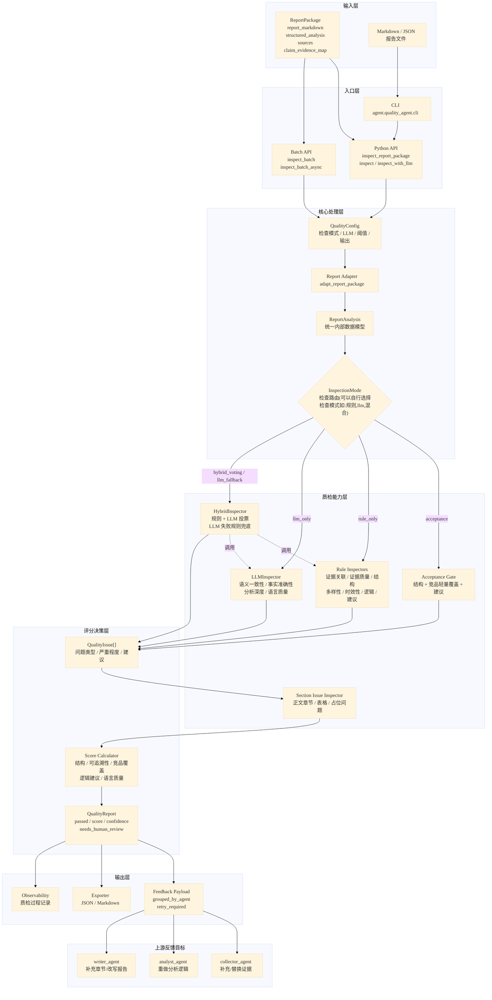

# Quality Agent

`quality_agent` 是多 Agent 竞品分析系统中的质检模块，负责对 `report_agent` 生成的竞品分析报告做结构、证据、逻辑、竞品覆盖和建议可执行性检查，并把检查结果转成可供工作流消费的反馈消息。

## 架构图



## 输入与输出

主要输入是 `report_agent.models.ReportPackage`，其中包含：

- `task_id`：任务标识。
- `report_markdown`：最终报告正文。
- `structured_analysis`：结构化分析结果，例如竞品列表、证据卡片、SWOT、建议等。
- `sources`：原始来源列表。
- `claim_evidence_map`：结论与证据的映射关系。

命令行入口也支持读取 Markdown 或 ReportPackage JSON 文件，并在内部组装成可检查对象。

主要输出是 `QualityReport`：

- `passed` 和 `score`：是否通过质检及 0-1 分数。
- `issues`：结构化问题列表，包含问题类型、严重程度、说明、修复建议、置信度和受影响字段。
- `suggestions`：修复建议摘要。
- `confidence_level`、`needs_human_review`：置信度和人工复核判断。
- `feedback_payload`：供 DAG/工作流使用的打回消息。
- 可选导出为 JSON 和 Markdown，默认路径由 `OutputConfig.output_dir` 控制。

## 工作流程

1. 接收报告输入

   外部可以通过 `inspect_report_package(package)`、`inspect(package)`、`inspect_with_llm(package)` 或 `cli.py` 发起质检。批量场景使用 `concurrent_inspection.py` 中的同步或异步接口。

2. 加载质检配置

   `QualityConfig` 支持直接传参、环境变量和配置文件。核心配置包括检查模式、LLM 参数、投票权重、并发参数、输出格式、最低分数阈值和是否保存结果。

3. 统一输入格式

   `adapters/report_adapter.py` 将 `ReportPackage` 转换为 `ReportAnalysis`。这一步会抽取证据列表、竞品名称、对比表、SWOT、建议、PM 洞察和报告正文，避免后续检查器直接依赖 `report_agent` 的原始结构。

4. 执行质量检查

   默认通过 `REPORT_AGENT_QUALITY_CHECK_SCOPE=acceptance` 走交付验收检查，只验证报告结构、轻量竞品覆盖和建议可执行性。若切换到完整模式，则根据 `InspectionMode` 选择规则检查、LLM 检查、混合投票或 LLM 失败后规则兜底。

5. 补充正文级问题

   `section_issue_inspector.py` 会根据最终报告正文补充章节级和表格级问题，例如固定章节缺失、待人工搜索占位、表格空项等。

6. 评分与通过判断

   `score_calculator.py` 按业务维度扣分：结构、可追溯性、竞品覆盖、逻辑建议、语言质量。严重问题扣分更高，完整报告、证据映射、多来源、竞品数量和建议内容会作为正向信号。

7. 生成反馈与导出

   `feedback.py` 将问题映射到应打回的上游 Agent。`exporter.py` 可把结果保存为稳定的 JSON 或人类可读 Markdown，方便工作流记录和人工复核。

## 组成模块

| 模块 | 作用 |
| --- | --- |
| `report_quality_agent.py` | 主入口，串联配置、适配、检查、评分、导出。 |
| `config.py` | 定义 `QualityConfig`、`QualityReport`、`QualityIssue`、问题类型、严重程度和检查模式。 |
| `adapters/report_adapter.py` | 将 `ReportPackage` 适配为内部统一的 `ReportAnalysis`。 |
| `inspectors/` | 各类检查器，包括证据、结构、竞品覆盖、逻辑一致性、建议可行性、LLM 和混合检查。 |
| `score_calculator.py` | 根据问题严重度和业务维度计算报告分数与置信度。 |
| `feedback.py` | 将质检问题转换为工作流可消费的打回消息。 |
| `exporter.py` | 输出 JSON 和 Markdown 质检报告。 |
| `concurrent_inspection.py` | 支持批量、异步质检和批量结果保存。 |
| `cli.py` | 命令行入口，支持从报告路径加载并执行质检。 |
| `observability.py` | 记录质检过程中的可观测性事件。 |
| `test/` | 单元测试、兼容性测试和真实报告冒烟测试。 |

## 检查维度

规则检查器覆盖以下维度：

- 结论和证据关联：检查 `claim_evidence_map` 是否存在、证据 ID 是否能对应到证据列表。
- 证据质量：检查来源是否为空、内容是否过短、是否是导航页或低质量来源。
- 报告结构：检查竞品分析报告的关键章节是否完整。
- 证据多样性和时效性：检查来源类型、域名分布和发布时间。
- 竞品覆盖：检查竞品数量、竞品表格和关键字段是否足够。
- 逻辑一致性：检查分析结论、SWOT 和建议之间是否矛盾。
- 建议可执行性：检查建议是否包含明确动作、优先级、时间框架或落地路径。

LLM 检查器补充语义一致性、事实准确性、分析深度和语言质量判断；混合检查器可以用投票方式合并 LLM 与规则结果，并在 LLM 不可用时回退到规则检查。

## 反馈闭环

`feedback.py` 将不同问题类型映射到对应上游 Agent：

| 问题类型 | 打回目标 | 典型修复方向 |
| --- | --- | --- |
| `missing_source`、`insufficient_evidence`、`low_quality_evidence`、`outdated_evidence` | `collector_agent` | 补充或替换来源，重新采集证据。 |
| `conflicting_evidence`、`logical_inconsistency` | `analyst_agent` | 重新分析证据关系，修正矛盾结论。 |
| `incomplete_info`、`weak_evidence_support` | `writer_agent` | 补充报告章节、改写结论或加强证据引用。 |

反馈输出格式包含 `retry_required`、`grouped_by_agent` 和逐条 `feedback_messages`，可以直接接入 `design_list.md` 中规划的 DAG 反馈闭环。

## 使用示例

Python 调用：

```python
from agent.quality_agent import QualityConfig, inspect_report_package

config = QualityConfig.from_env()
result = inspect_report_package(report_package, config=config)

if not result.passed:
    for issue in result.issues:
        print(issue.type.value, issue.severity.value, issue.suggestion)
```

命令行调用：

```bash
python -m agent.quality_agent.cli path/to/report.json --output-format json --output-dir reports/quality_inspections
```

批量调用：

```python
from agent.quality_agent import inspect_batch

results = inspect_batch(report_packages, config=config)
```
