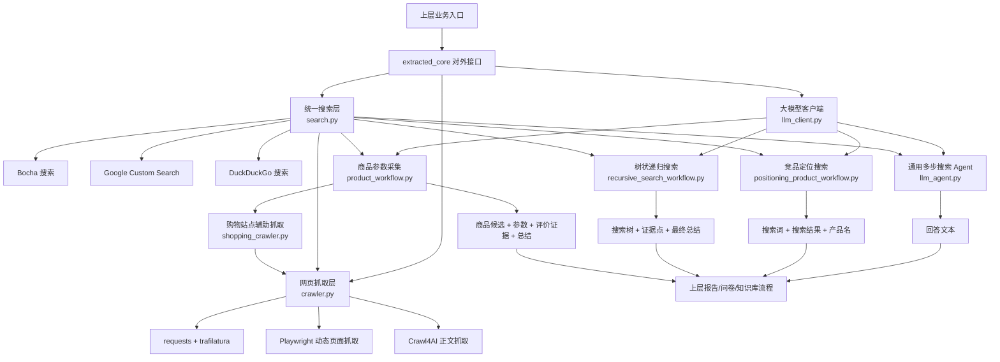
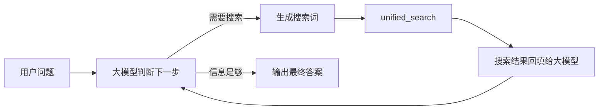
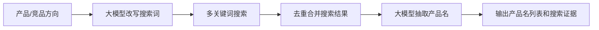
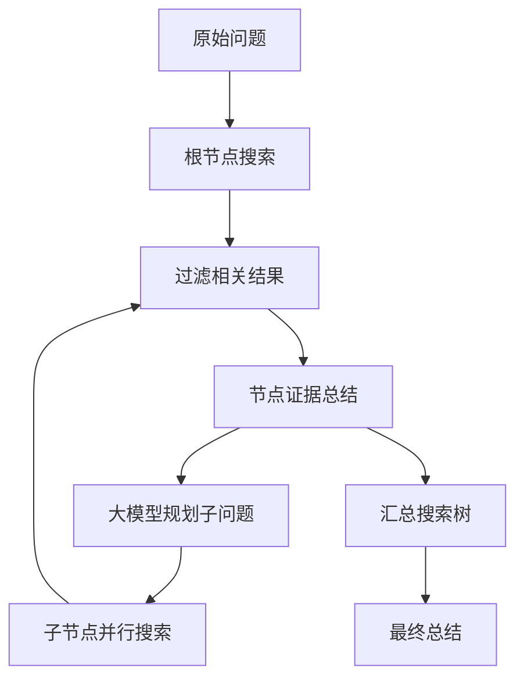
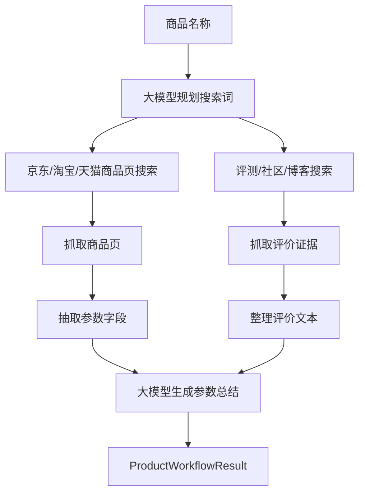
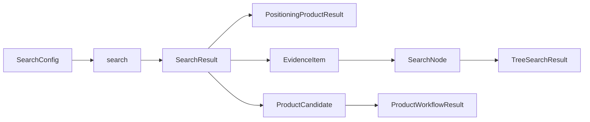
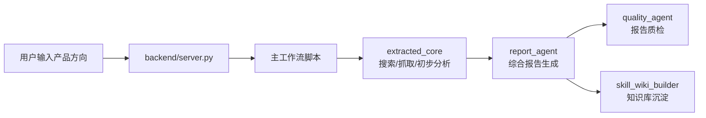

# extracted_core 架构说明

`extracted_core/` 是项目里的搜索、抓取、大模型调用和产品发现核心层。它不负责 Web 页面展示，也不直接生成最终竞品报告，而是给上层工作流提供可复用的“资料获取与初步理解”能力。

上层常见调用方包括：

- `backend/server.py`
- `run_similar_product_reports_with_new_analyze_quality.py`
- `generate_competitor_questionnaire.py`
- `report_agent/search_adapter.py`

## 总体架构流程图



## 分层说明

### 1. 对外接口层

`__init__.py` 汇总了常用类和函数，让上层可以直接从 `extracted_core` 导入。

常用导出包括：

- `SearchConfig`
- `SearchResult`
- `SearchSource`
- `search`
- `unified_search`
- `fetch_page_text`
- `run_agent`
- `run_agent_generator`
- `run_positioning_product_search`
- `run_recursive_search`
- `run_tree_search`

### 2. 大模型调用层

`llm_client.py` 是项目内最小化的大模型客户端，负责调用兼容 OpenAI 的 `/chat/completions` 接口。

它提供：

- `create_chat_completion()`：返回完整 JSON 响应。
- `chat_content()`：返回第一条回答文本。
- `stream_chat_content()`：流式返回回答片段。

这一层只处理 HTTP 请求、重试、超时和响应解析，不关心搜索、报告或业务逻辑。

### 3. 搜索与抓取层

`search.py` 提供统一搜索入口。

搜索源：

- `bocha`
- `google`
- `duckduckgo`

抓取后端：

- `crawl_backend=0`：传统抓取，使用 `requests + trafilatura`。
- `crawl_backend=1`：Playwright 动态页面抓取。
- `crawl_backend=2`：Crawl4AI 正文抓取。

核心数据结构：

| 名称 | 说明 |
| --- | --- |
| `SearchSource` | 搜索源枚举。 |
| `SearchConfig` | 搜索配置，包括搜索源、API Key、代理、结果数量、抓取后端、超时等。 |
| `SearchResult` | 标准化搜索结果，包括标题、链接、摘要、正文、来源和正文来源。 |

主要函数：

| 函数 | 说明 |
| --- | --- |
| `search()` | 返回结构化 `SearchResult` 列表。 |
| `unified_search()` | 返回适合直接喂给大模型的格式化搜索结果文本。 |
| `format_results()` | 将搜索结果格式化为文本。 |

`crawler.py` 是基础网页正文抽取模块，提供：

- `fetch_page_text()`：下载网页并抽取可读正文。
- 优先使用 `trafilatura`。
- 失败时回退到 `BeautifulSoup`、`meta description`、`JSON-LD`、脚本字段等抽取方式。

## 主要工作流

### 通用多步搜索 Agent

文件：`llm_agent.py`

适合场景：让大模型自己决定是否继续搜索，直到得到最终答案。

流程：



关键组件：

- `AgentConfig`：大模型配置、搜索配置、最大步数。
- `AgentEvent`：流式事件，记录思考、动作、搜索结果和最终答案。
- `run_agent_generator()`：生成过程事件。
- `run_agent()`：只返回最终答案。

### 竞品定位搜索

文件：`positioning_product_workflow.py`

适合场景：用户只输入一个产品方向，系统需要自动找到相关产品、竞品或替代品。

流程：



关键组件：

| 名称 | 说明 |
| --- | --- |
| `PositioningProductConfig` | 大模型、搜索、搜索词数量、每词结果数等配置。 |
| `PositioningProductResult` | 输出产品描述、搜索词、搜索结果和产品名。 |
| `rewrite_search_queries()` | 将用户输入改写为适合搜索竞品的关键词。 |
| `collect_search_results()` | 执行多关键词搜索并去重。 |
| `extract_product_names()` | 从搜索结果中抽取真实产品名。 |
| `run_positioning_product_search()` | 完整竞品定位流程入口。 |

### 树状递归搜索

文件：`recursive_search_workflow.py`

适合场景：需要围绕一个复杂问题逐层展开搜索，形成搜索树和证据链。

流程：



关键组件：

| 名称 | 说明 |
| --- | --- |
| `RecursiveSearchConfig` | 递归轮数、每层子查询数、证据数量、并发数、超时等配置。 |
| `EvidenceItem` | 单条证据，包含搜索词、轮次、标题、链接、摘要和正文。 |
| `SearchNode` | 搜索树节点，包含当前查询、证据、总结和子节点。 |
| `TreeSearchResult` | 树状搜索结果，包括根节点、全部证据、树总结和最终答案。 |
| `run_tree_search()` | 树状递归搜索主入口。 |
| `run_recursive_search()` | 兼容旧用法的递归搜索入口。 |
| `render_tree_summary()` | 将搜索树渲染成可读文本。 |

### 商品参数采集工作流

文件：`product_workflow.py`

适合场景：围绕一个具体商品，搜索京东、淘宝、天猫页面和评测内容，提取商品参数并生成总结。

流程：



关键组件：

| 名称 | 说明 |
| --- | --- |
| `ProductWorkflowConfig` | 大模型配置、搜索配置、抓取数量、超时和正文长度限制。 |
| `ProductCandidate` | 商品候选页，包括平台、标题、链接、正文和抽取参数。 |
| `ReviewEvidence` | 评测/社区/博客证据。 |
| `ProductWorkflowResult` | 商品名、候选商品、评测证据、总结和原始提示词。 |
| `plan_search_queries()` | 为商品页和评测内容规划搜索词。 |
| `collect_product_candidates()` | 收集京东、淘宝、天猫商品候选。 |
| `collect_review_evidence()` | 收集评测类证据。 |
| `summarize_product_candidates()` | 调用大模型生成中文参数总结。 |
| `run_product_workflow()` | 商品参数采集主入口。 |

### 购物站点辅助抓取

文件：`shopping_crawler.py`

适合场景：从京东、淘宝、天猫搜索页或结果页中抽取真实商品链接。

核心能力：

- 识别京东商品链接。
- 识别淘宝/天猫商品链接。
- 标准化 URL。
- 抽取商品标题和页面正文。
- 输出 `ShoppingSearchHit`。

## 组件功能总表

| 文件 | 组件定位 | 主要功能 |
| --- | --- | --- |
| `__init__.py` | 对外导出层 | 汇总常用类和函数，简化上层导入。 |
| `llm_client.py` | 大模型 HTTP 客户端 | 调用兼容 OpenAI 的聊天接口，支持普通和流式输出。 |
| `crawler.py` | 基础网页抓取 | 用 `requests` 下载网页，用 `trafilatura` 和回退策略抽取正文。 |
| `search.py` | 统一搜索层 | 接入 Bocha、Google、DuckDuckGo，并为结果补正文。 |
| `llm_agent.py` | 多步搜索 Agent | 让大模型决定继续搜索或输出答案。 |
| `recursive_search_workflow.py` | 树状递归搜索 | 多层子问题搜索、证据过滤、节点总结和最终综合。 |
| `positioning_product_workflow.py` | 竞品定位 | 改写搜索词、搜索同类产品、抽取产品名。 |
| `product_workflow.py` | 商品参数采集 | 搜索电商页和评测内容，抽取商品参数并总结。 |
| `shopping_crawler.py` | 电商辅助抓取 | 抽取京东、淘宝、天猫商品链接和正文。 |
| `example.py` | 通用示例 | 演示多步搜索 Agent。 |
| `product_example.py` | 商品示例 | 演示商品参数采集和递归搜索。 |
| `positioning_product_example.py` | 竞品定位示例 | 演示产品定位搜索流程。 |
| `requirements.txt` | 依赖清单 | 当前核心模块所需依赖。 |

## 数据结构关系



常用数据结构：

| 数据结构 | 来源文件 | 说明 |
| --- | --- | --- |
| `SearchConfig` | `search.py` | 搜索和抓取配置。 |
| `SearchResult` | `search.py` | 标准化搜索结果。 |
| `AgentConfig` | `llm_agent.py` | 通用多步搜索 Agent 配置。 |
| `PositioningProductResult` | `positioning_product_workflow.py` | 竞品定位搜索输出。 |
| `EvidenceItem` | `recursive_search_workflow.py` | 递归搜索证据点。 |
| `SearchNode` | `recursive_search_workflow.py` | 搜索树节点。 |
| `TreeSearchResult` | `recursive_search_workflow.py` | 树状搜索完整结果。 |
| `ProductWorkflowResult` | `product_workflow.py` | 商品参数采集完整结果。 |
| `ShoppingSearchHit` | `shopping_crawler.py` | 电商搜索命中项。 |

## 在主项目中的典型位置



`extracted_core` 处在主项目的数据获取和证据构建前段。它的输出会被后续 Report Agent、问卷生成、质量检查和知识库构建继续消费。

## 依赖

安装核心依赖：

```powershell
python -m pip install -r extracted_core\requirements.txt
```

如果使用 Playwright 或 Crawl4AI 抓取动态页面，还需要初始化浏览器环境：

```powershell
python -m playwright install chromium
```

项目根目录的 `install_project_env.ps1` 已经会统一处理这些依赖。

## 常用环境变量

```text
LLM_API_KEY
LLM_BASE_URL
LLM_MODEL
LLM_PROVIDER
LLM0_API_KEY
LLM0_BASE_URL
LLM0_MODEL
BOCHA_API_KEY
GOOGLE_API_KEY
GOOGLE_CX_ID
SEARCH_SOURCE
SEARCH_BACKEND
HTTP_PROXY
```

## 备注

- 所有密钥建议通过环境变量或 Web 配置传入，不要写死到代码里。
- 搜索结果会尽量补充网页正文，但遇到登录、反爬、动态渲染时可能只能保留摘要。
- `search.py` 内置了部分默认黑名单，用于过滤明显低价值页面。
- 复杂问题优先使用 `run_tree_search()`，简单问答可使用 `run_agent()`，只找竞品名可使用 `run_positioning_product_search()`。
