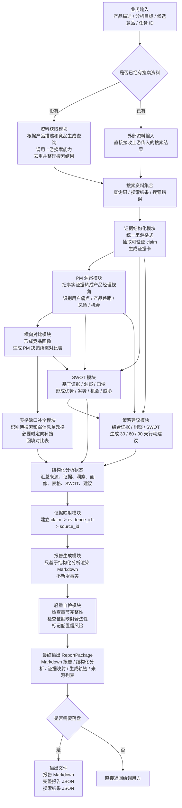
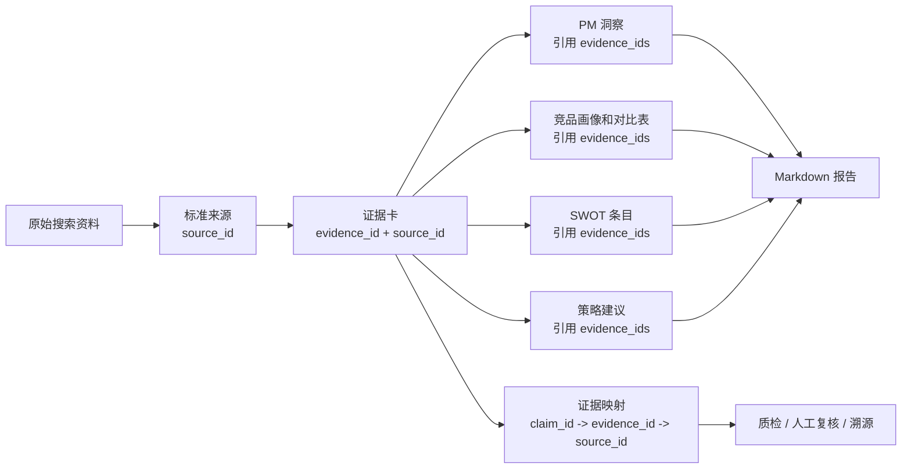

# report_agent 项目架构

`report_agent` 是竞品分析报告生成模块。它的核心工作不是简单拼接文本，而是把“业务需求和搜索资料”逐步加工成“可追溯、可检查、可落盘的竞品分析报告包”。

模块整体遵循一条固定主线：

```text
业务输入
-> 搜索资料
-> 标准化来源
-> 证据卡
-> PM 洞察
-> 竞品画像与对比表
-> 表格缺口补全
-> SWOT 战略判断
-> 产品策略建议
-> Markdown 报告
-> 自检后的 ReportPackage
```

其中最重要的约束是：报告里的判断必须能通过 `evidence_id` 回溯到原始 `source_id`，避免生成无来源、不可检查的结论。

## 总体架构图



## 模块说明

### 1. 业务输入模块

负责接收本次竞品分析任务的基础信息。

输入内容包括：

- 产品描述或调研主题，例如“AI IDE 编程助手竞品分析”。
- 可选候选竞品，例如 `Trae`、`Cursor`。
- 任务 ID，用于输出包和落盘文件命名。
- 分析目标，例如“生成面向产品经理的竞品分析报告”。
- 分析领域，例如 “AI Agent”。
- 可选写作配置，例如是否启用 LLM、表格缺口是否补搜、输出目录等。

完成后进入下一步：

- 如果调用方已经传入搜索结果，直接进入证据结构化。
- 如果调用方只提供业务需求，则先进入资料获取模块。

### 2. 资料获取模块

负责把业务需求转成可用于报告生成的资料集合。

它做的工作包括：

- 根据产品描述和候选竞品生成搜索查询。
- 调用上游搜索能力获取网页标题、链接、摘要和正文内容。
- 对搜索结果按 URL 或标题摘要做去重。
- 收集搜索错误，避免单个查询失败导致整个流程中断。
- 输出统一的搜索资料集合。

本阶段输出：

```text
搜索资料集合
├── queries: 本次实际执行的搜索查询
├── results: 去重后的搜索结果
└── errors: 搜索过程中的错误信息
```

完成后进入下一步：

- 搜索结果会被送入证据结构化模块。
- 搜索错误会保留到最终结果中，方便复盘。

### 3. 证据结构化模块

负责把杂乱的搜索资料整理成可追溯的最小事实单元。

它做的工作包括：

- 把不同形态的搜索结果统一成标准来源记录。
- 从标题、摘要、正文中抽取可以支撑判断的片段。
- 将片段归类到产品经理关心的维度，例如用户场景、任务完成、Agent 能力、信任控制、体验、集成、定价、壁垒、用户反馈。
- 每条证据只表达一个 claim，并保存原始片段。
- 为每条证据分配 `evidence_id`，同时保留对应 `source_id`。
- LLM 可用时使用模型按 schema 归一化；不可用时使用本地规则兜底。

本阶段输出：

```text
标准来源 SourceRecord
├── source_id
├── title
├── url
├── snippet
├── content
└── 来源元数据

证据卡 EvidenceCard
├── evidence_id
├── source_id
├── competitor
├── dimension
├── claim
├── raw_excerpt
├── confidence
├── freshness
└── importance_for_pm
```

完成后进入下一步：

- `EvidenceCard` 会作为后续所有分析的事实基础。
- 后续模块生成洞察、表格、SWOT、建议时都必须引用已有 `evidence_id`。

### 4. PM 洞察模块

负责把事实证据转成产品经理可直接消费的分析判断。

它做的工作包括：

- 聚合相同维度或相同问题下的证据。
- 判断证据反映的是用户痛点、产品差距、差异化、风险还是机会。
- 不只复述资料，而是解释“这对定位、路线、商业化、增长或风险意味着什么”。
- 校验每条洞察必须绑定已有 `evidence_id`。
- LLM 不可用时按证据维度生成保守洞察，保证流程完整。

本阶段输出：

```text
PMInsight
├── insight_id
├── type: user_pain / product_gap / differentiation / risk / opportunity
├── title
├── description
├── related_competitors
├── evidence_ids
├── pm_value
└── confidence
```

完成后进入下一步：

- 洞察会进入横向对比模块，帮助决定对比表应该围绕哪些维度展开。
- 洞察也会进入 SWOT 和策略建议模块，支撑后续战略判断。

### 5. 横向对比模块

负责把证据和洞察组织成竞品分析报告里的核心结构化对比内容。

它做的工作包括：

- 根据候选竞品和证据中识别到的竞品名确定对比对象。
- 为每个竞品生成画像，包括目标用户、核心场景、产品形态、主要入口、商业模式和战略判断。
- 生成横向对比表，例如定位对比、能力对比、用户旅程对比、商业化对比等。
- 表格必须服务 PM 决策，不追求固定模板，而是根据已有资料选择最有价值的对比维度。
- 对没有证据支持的单元格标记为待搜索或未找到明确证据，而不是猜测。
- LLM 不可用时生成保守 fallback 表，保证报告结构完整。

本阶段输出：

```text
竞品画像 competitor_profiles
├── competitor
├── target_user
├── core_scenario
├── product_form
├── main_entry
├── business_model
├── strategic_judgement
└── evidence_ids

横向对比表 comparison_tables
├── table_name
├── columns
└── rows / dimensions
```

完成后进入下一步：

- 初版竞品画像和对比表会进入表格缺口补全模块。
- 竞品画像也会进入 SWOT 模块，用于形成战略判断。

### 6. 表格缺口补全模块

负责处理对比表中缺失、弱证据或需要进一步确认的信息。

它做的工作包括：

- 扫描竞品画像和对比表，找出空值、弱信息、`待搜索` 单元格。
- 把每个缺口整理成可处理的 `TableGap`。
- 判断哪些缺口值得补搜，哪些应该保留为“未找到明确产品级证据”。
- 为需要补搜的缺口生成更精确的搜索查询。
- 调用搜索能力执行定向补搜。
- 从补搜结果中提取可用事实并回填表格。
- 如果补搜仍无法确认，则保留缺口状态，不编造内容。

本阶段输出：

- 补全后的竞品画像。
- 补全后的横向对比表。
- 仍然无法确认的信息会被明确标记，供报告和后续质检识别。

完成后进入下一步：

- 补全后的表格进入最终结构化分析状态。
- 报告生成阶段会直接渲染这些表格。

### 7. SWOT 模块

负责把证据、洞察和竞品画像转成战略判断。

它做的工作包括：

- 识别竞品或市场中的优势、劣势、机会和威胁。
- 区分内部因素和外部因素：优势/劣势偏竞品内部，机会/威胁偏市场环境和用户需求。
- 结合问卷、用户侧资料或我方产品参数时，会明确区分它们不是竞品官方事实。
- 每条 SWOT 都必须绑定已有 `evidence_id`。
- LLM 不可用时按证据维度生成保守 SWOT。

本阶段输出：

```text
SWOTResult
├── strengths
├── weaknesses
├── opportunities
└── threats

SWOTItem
├── point
├── why_it_matters
├── evidence_ids
├── pm_implication
└── confidence
```

完成后进入下一步：

- SWOT 会进入策略建议模块，用于生成可执行路线图。
- SWOT 也会进入最终结构化分析和 Markdown 报告。

### 8. 策略建议模块

负责把前面的分析结论转成可执行的产品行动。

它做的工作包括：

- 综合证据卡、PM 洞察和 SWOT 判断。
- 生成 30 / 60 / 90 天路线图。
- 为每条建议补充优先级、行动、原因、预期影响、风险和成功指标。
- 校验建议必须绑定已有 `evidence_id`。
- 如果资料不足，会输出保守建议，而不是生成无来源结论。

本阶段输出：

```text
ProductRecommendation
├── priority: P0 / P1 / P2
├── timeframe: 30_days / 60_days / 90_days
├── action
├── reason
├── expected_impact
├── risk
├── evidence_ids
└── success_metric
```

完成后进入下一步：

- 策略建议进入最终结构化分析状态。
- 报告生成阶段会将其渲染为产品策略建议章节。

### 9. 结构化状态汇总模块

负责把各阶段产物合并成一个内部分析状态。

它汇总的内容包括：

- 任务 ID、分析目标、分析领域、候选竞品。
- 标准来源记录。
- 证据卡。
- PM 洞察。
- 竞品画像。
- 横向对比表。
- SWOT。
- 产品策略建议。
- 报告正文。
- 证据映射。
- 生成轨迹。
- 缺失信息和低置信风险。

完成后进入下一步：

- 先建立 `claim_evidence_map`。
- 再进入 Markdown 报告生成。

### 10. 证据映射模块

负责建立报告可检查性的核心协议。

它做的工作包括：

- 遍历每张证据卡。
- 为每个 claim 生成 `claim_id`。
- 建立 `claim_id -> claim -> evidence_id -> source_id` 映射。
- 保留证据置信度。

本阶段输出：

```text
claim_evidence_map
├── claim_id
├── claim
├── evidence_ids
├── source_ids
└── confidence
```

完成后进入下一步：

- 报告包会携带该映射。
- 下游质检或人工审查可以沿着该映射回查原始来源。

### 11. 报告生成模块

负责把结构化分析渲染为 Markdown 报告。

它做的工作包括：

- 基于已有结构化分析生成报告正文。
- 默认使用本地 renderer，保证无 LLM 环境也能输出稳定报告。
- 可选使用 LLM 润色，但仍要求只能基于结构化分析，不允许新增事实。
- 渲染核心章节：核心结论、分析背景与目标、竞品分类、用户场景、重点竞品拆解、横向能力对比、SWOT、产品机会点与风险、产品策略建议、资料来源。
- 表格没有证据时明确写“未找到明确证据”或“暂无可渲染对比数据”。

本阶段输出：

```text
report_markdown
```

完成后进入下一步：

- Markdown 报告进入轻量自检模块。

### 12. 轻量自检模块

负责在输出前做基本完整性检查。

它做的工作包括：

- 检查报告是否包含必备章节。
- 检查每个 claim 的 `evidence_id` 是否存在。
- 检查每个 claim 的 `source_id` 是否存在。
- 检查 SWOT 是否绑定合法证据。
- 把缺失章节写入 `missing_info`。
- 把低置信或映射异常的 claim 写入 `low_confidence_claims`。

完成后进入下一步：

- 生成最终 `ReportPackage`。

## 输出结构

最终输出是 `ReportPackage`，它同时面向人读报告和机器质检。

```text
ReportPackage
├── task_id
├── report_markdown
├── structured_analysis
│   ├── executive_summary
│   ├── evidence_cards
│   ├── pm_insights
│   ├── competitor_profiles
│   ├── comparison_tables
│   ├── swot
│   ├── recommendations
│   └── product_recommendations
├── claim_evidence_map
├── generation_trace
├── sources
├── missing_info
└── low_confidence_claims
```

字段含义：

- `report_markdown`: 最终可阅读的竞品分析报告。
- `structured_analysis`: 报告背后的结构化分析结果，适合下游程序读取。
- `claim_evidence_map`: claim 到 evidence/source 的追溯映射。
- `generation_trace`: 每个阶段消费了哪些引用、产出了哪些引用。
- `sources`: 标准化来源列表。
- `missing_info`: 自检发现的缺失信息。
- `low_confidence_claims`: 低置信或证据映射异常的判断。

## 证据追溯结构图



追溯链路是：

```text
报告判断
-> claim_id
-> evidence_id
-> source_id
-> 原始标题 / URL / 摘要 / 正文片段
```

因此，报告不是只输出自然语言，还会同时输出支撑报告的证据结构，方便后续检测、复核和迭代。

## 配置与运行特性

主要运行配置包括：

- 是否启用 LLM。关闭后仍可使用本地规则完成完整流程。
- LLM 的 API Key、Base URL、模型名、超时时间和并发批处理数量。
- 证据结构化模式：纯规则、规则切片后 LLM 归一化、整源 LLM 优先。
- 表格缺口补搜是否开启、补搜轮数、每轮查询数量、爬取字符数。
- 搜索来源和搜索 API 凭证。
- 是否导出对比表。
- 日志回调和详细输出开关。

## 输出落盘

如果调用方配置输出目录，模块会额外写出三类文件：

```text
{timestamp}_{task_id}_report.md
{timestamp}_{task_id}_report_package.json
{timestamp}_{task_id}_search_results.json
```

含义：

- `report.md`: 最终 Markdown 报告。
- `report_package.json`: 完整报告包，包含结构化分析和证据映射。
- `search_results.json`: 原始搜索查询、搜索结果和搜索错误，用于复盘。
